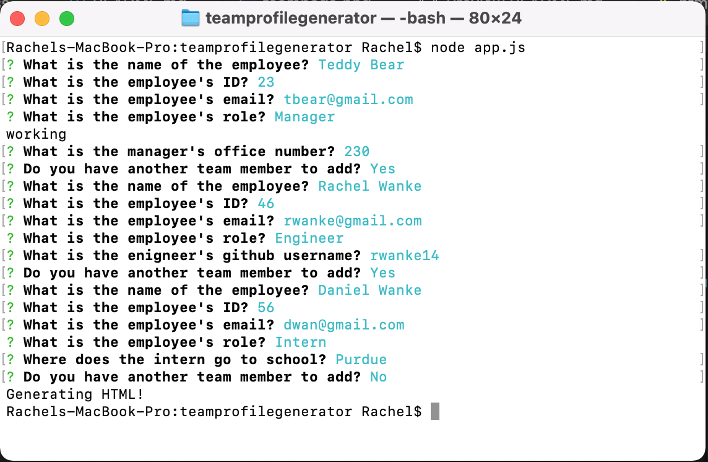
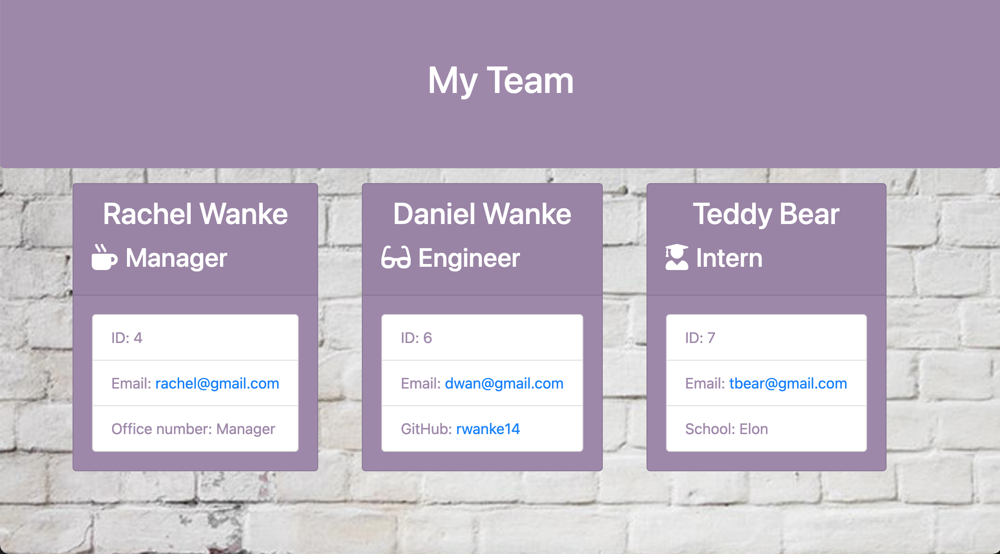

# Team Profile Generator

## Description

This application runs prompts in the your git or terminal to write an html file for a set of employees at a job. It includes three categories for employees, which are manager, engineer, and intern. Using inqurier it sets up the prompts for the terminal and prompts the user to fill in the necessary information to populate the information to the hmtl file. 

 

## Installation and Instructions

        1. Load Packages:

            npm i

        2. Run Application:

            node app.js
 

## Testing

Using jest tests are run on the files in the library folder to confirm they will populate the correct information when write file is triggered to render the html file. 

 

## Video Walkthrough:

 

## Screenshots of terminal prompts:
 

 

## Screenshot of team.html:
 

 

## Link to repository:

https://github.com/rwanke14/teamprofilegenerator

 

## Additional sources:

Also worked with my study group to better understand how to apply what we learned in class to this readme. Note: Some code may look similar since we generally come out these thinking in the same ways. 

Feedback, brainstorming, and general support to study group:

        1. Young Ji Kim - https://github.com/youjmi
        2. Amir Ashtiany - https://github.com/Alexfit4
        3. Johnnie Simpson - https://github.com/balokdecoy
        5. Frankie Rosado - https://github.com/Franciscorosado09

